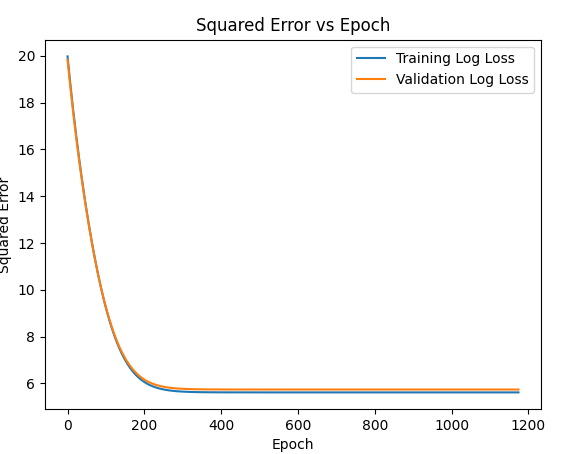
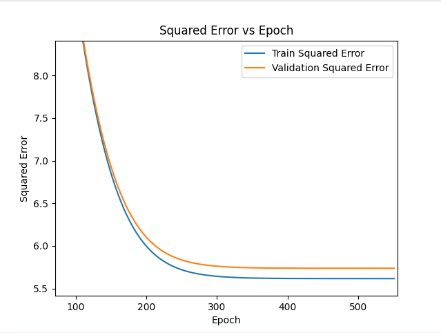
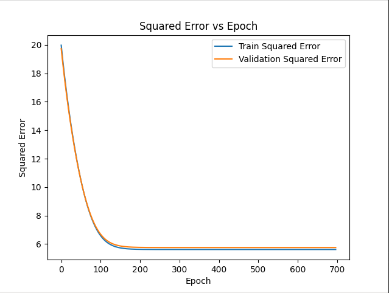
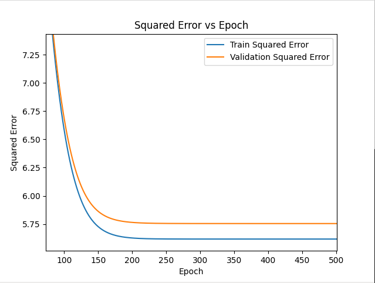

# Under Water Passive Acoustic Source Localization

We developed a model to track distances of the sea floor. 
The processed dataset is too large to store in github so we are storing it in a shared drive that can handle its compressed size (12.5 Gb) here: 

[SW96_CSDM.zip](https://drexel0-my.sharepoint.com/:u:/g/personal/nh585_drexel_edu/EetAsTAddv1NkG7vvt8LyzMBzpbld3eytqdwNIMFJz6APA?e=4pYVsr) 

Please download it and uncompress it and add it to the same folder as your **PassiveSonarUnderWaterDetection** cloned repo or forked branch lives locally. 


## Getting Started

First install the requirements needed for this project (NOTE: The SW96_CSDM.zip is needed as well please download and uncompross to local git repo)
Make sure to run from the **PassiveSonarUnderWaterDetection** folder: 
```bash

python install_requirements.py
```

Next run the flatten script to make the large dataset more managable: 

```bash
python flatten_sw96_CSDM.py
```

You should now see a flattened_data.h5 in your local repo folder. If not check terminal for errors and try again.

You should also see **Training_and_Validation.h5** which is our refined and preprocessed dataset after PCA to reduce the large feature set.

So the dataset goes from roughly 300,000 features -> 1256 features with a **Variance retained: 99.66%**

Now we are ready to train ! Go ahead and run the mlp.py (This is just a basic MLP with shallow layers)

```bash
python mlp.py
```

There are other flavors of the training and validation **mlp.py, mlp_skip.py, mlp_deep.py**

The **mlp_skip.py** is also a shallow architecture with skip risiduals allowing us to pass data past the first FullyConnected and TanH layers all the way to the second FullyConnected layer

The **mlp_deep.py** is a 50 layer deep architecture with skip risiduals that has multiple FullyConnected and TanH layers with equal parts skip risiduals, our special concoction muhahahah

All of these are runnable as long as the **Training_and_Validation.h5** data exists, otherwise please see the top of **Getting Started** 

Please note: runtimes may vary and some take longer to run, we added special optimizations to speedup the runtime as much as mathematically is allowable but alas some things bound us to time

## Some Results

The first graph is an image of how the training vs validation performs for the shallow mlp with NO skip risiduals, right side is just zoomed in:

MLP Shallow Training VS Validation w.r.t. Epochs             |  MLP Shallow Training VS Validation w.r.t. Epochs Zoomed in
:-------------------------:|:-------------------------:
  |  

We achieve an Validation Loss, RMSE and SMAPE for Validation in the shallow architecture of: **Validation Loss = 5.7398328336, SMAPE = 0.2900421048, RMSE = 0.0618592372**

Epoch 3000: Train Loss = 0.9672478040, Val Loss = 10.3759651500, Train SMAPE = 0.1500510150, Train RMSE = 0.0179562227, Val SMAPE = 0.3783200382, Val RMSE = 0.0831704280
Converged at epoch 3012

Running the mlp with a skip residual : 

```bash
python mlp_skip.py
```

We can see even better outputs in the following graph. The second graph is an image of how training vs validation performs for the shallow mlp (Same framework as the one above) including a skip risidual where we skip most of the hidden layers in a branch and then fuse the two processing branches, right side is the same thing just zoomed in:

One important thing to note with skip residuals in this example is convergance happens much sooner before we would get convergance on epoch 1100  but now with skip residuals we converge around epoch 696

MLP Shallow w. Skip Residual Training VS Validation w.r.t. Epochs             |  MLP Shallow w. Skip Residual Training VS Validation w.r.t. Epochs Zoomed in
:-------------------------:|:-------------------------:
  |  

We achieve an Validation Loss, RMSE and SMAPE for Validation in the shallow architecture of: **Validation Loss = 5.7540781178, SMAPE = 0.2991907063, RMSE = 0.0619359514**

Epoch 4600: Train Loss = 1.4718474086, Val Loss = 10.6940970060, Train SMAPE = 0.1863646859, Train RMSE = 0.0221500746, Val SMAPE = 0.3940859529, Val RMSE = 0.0844358218
Convergence detected. Early stopping initiated.
Training Time: 627.61 seconds

