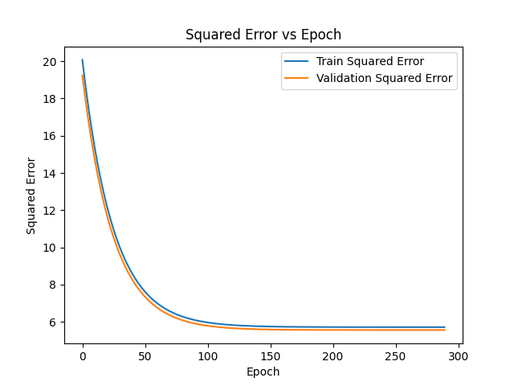

# Under Water Passive Acoustic Source Localization

We developed a model to track distances of the sea floor. 
The processed dataset is too large to store in github so we are storing it in a shared drive that can handle its compressed size (12.5 Gb) here: 

[SW96_CSDM.zip](https://drexel0-my.sharepoint.com/:u:/g/personal/nh585_drexel_edu/EetAsTAddv1NkG7vvt8LyzMBzpbld3eytqdwNIMFJz6APA?e=4pYVsr) 

Please download it and uncompress it and add it to the same folder as your **PassiveSonarUnderWaterDetection** cloned repo or forked branch lives locally. 


## Getting Started

First install the requirements needed for this project (NOTE: The SW96_CSDM.zip is needed as well please download and uncompross to local git repo)
Make sure to run from the **PassiveSonarUnderWaterDetection** folder: 
```bash

python install_requirements.py
```

Next run the flatten script to make the large dataset more managable: 

```bash
python flatten_sw96_CSDM.py
```

You should now see a flattened_data.h5 in your local repo folder. If not check terminal for errors and try again.

You should also see **Training_and_Validation.h5** which is our refined and preprocessed dataset after normalization using Z_scoring and flattening a 4500, 21, 21 -> 4500, 441

Now we are ready to train ! Go ahead and run the mlp.py (This is just a basic MLP with shallow layers)

```bash
python mlp.py
```

There are other flavors of the training and validation **mlp.py, mlp_skip.py, mlp_deep.py**

The **mlp_skip.py** is also a shallow architecture with skip risiduals allowing us to pass data past the first FullyConnected and TanH layers all the way to the second FullyConnected layer

The **mlp_deep.py** is a 18 layer deep architecture with skip risiduals that has multiple FullyConnected and TanH layers with equal parts skip residuals, our special concoction muhahahah

All of these are runnable as long as the **Training_and_Validation.h5** data exists, otherwise please see the top of **Getting Started** 

Please note: runtimes may vary and some take longer to run, we added special optimizations to speedup the runtime as much as mathematically is allowable but alas some things bound us to time

## Some Results

The first graph is an image of how the training vs validation performs for the shallow mlp with NO skip risiduals, right side is just zoomed in:

MLP Shallow Training VS Validation Squared Error w.r.t. Epochs       |  MLP Shallow Training VS Validation Accuracy  |  MLP Shallow ground truth vs prediction
:-------------------------:|:-------------------------:|:-------------------------:
  |   |  

We achieve an Validation Loss, RMSE and SMAPE for Validation in the shallow architecture of: **converged at epoch 2400: Train Loss = 1.0456665818, Val Loss = 10.6331876182, Train Acc = 0.9486666667, Val Acc = 0.7174440000, Train SMAPE = 0.1572280949, Train RMSE = 0.0186699097, Val SMAPE = 0.3876432678, Val RMSE = 0.0841950221**


### Running the mlp with a skip residual : 

```bash
python mlp_skip.py
```

We can see even better outputs in the following graph. The second graph is an image of how training vs validation performs for the shallow mlp (Same framework as the one above) including a skip risidual where we skip most of the hidden layers in a branch and then fuse the two processing branches, right side is the same thing just zoomed in:

One important thing to note with skip residuals in this example is convergance happens much sooner before we would get convergance on epoch 1100  but now with skip residuals we converge around epoch 696

MLP Shallow w. Skip Residual Squared Error Training VS Validation w.r.t. Epochs   |  MLP Shallow w. Skip Residual Accuracy Training vs Validation | MLP shallow w. Skip Residual Prediction vs Ground Truth
:-------------------------:|:-------------------------:|:-------------------------:
  |   |  

We achieve an Validation Loss, RMSE and SMAPE for Validation in the shallow architecture of: **converged at epoch 4600: Train Loss = 2.7221100732, Val Loss = 11.2383338799, Train Acc = 0.8816666667, Val Acc = 0.6987817778, Train SMAPE = 0.2208306058, Train RMSE = 0.0301227493, Val SMAPE = 0.3947290627, Val RMSE = 0.0865576836**


### Running the mlp Deep without skip res : 

```bash
python mlp_deep.py
```

We can see 

MLP Deep Training VS Validation w.r.t. Epochs             |  MLP DEEP  accuracy training vs validation
:-------------------------:|:-------------------------:
  |  

We achieve an Validation Loss, RMSE and SMAPE for Validation in the shallow architecture of: **Converged on epoch 280: Train Loss = 5.7057889098, Val Loss = 5.5517457376, Train Accuracy: 0.7527, Val Accuracy: 0.7487, Train SMAPE = 0.2935238322, Train RMSE = 0.0436112329, Val SMAPE = 0.2919700626, Val RMSE = 0.0608372733**


### Running the mlp Deep with skip residuals also known as ResNet : 

```bash
python mlp_deep_skip.py
```

We can see 

MLP Deep with Skip Residiual Training VS Validation w.r.t. Epochs             |  MLP DEEP with Skip accuracy training vs validation
:-------------------------:|:-------------------------:
  |  

We achieve an Validation Loss, RMSE and SMAPE for Validation in the shallow architecture of: **Converged on epoch 290: Train Loss = 5.6404102459, Val Loss = 5.6824371070, Train Accuracy: 0.7513, Val Accuracy: 0.7513, Train SMAPE = 0.2923311190, Train RMSE = 0.0433606590, Val SMAPE = 0.2944014459, Val RMSE = 0.0615491787**